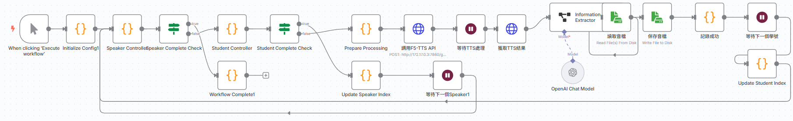

# N8N自動化數據生成工作流程

## 概述

本工作流程是一個基於n8n平台的自動化數據生成系統，專門為Kaggle #2競賽生成高質量的中文推理訓練數據。該工作流程能夠自動生成包含推理鏈的選擇題，用於訓練中文大語言模型處理敏感政治議題。

## 工作流程架構


*N8N自動化數據生成工作流程的完整視覺化界面*

### 核心設計理念

1. **三層嵌套循環結構**：確保數據的全面性和系統性
2. **推理鏈生成**：每個問題都包含詳細的推理過程
3. **中立性保證**：通過多重檢查確保問題的客觀性
4. **可擴展性**：支援動態調整主題、難度和問題類型

### 工作流程結構

```
工作流程階層：
├── 15個主題領域
│   ├── 3個難度等級（基礎、中級、高級）
│   │   ├── 5個問題類型（事實性、概念性、分析性、比較性、評估性）
│   │   │   └── 每次生成3個問題
│   │   └── 總計：15 × 3 × 5 × 3 = 675個問題
```

## 技術規格

### 主要節點功能

根據工作流程視覺化圖，主要節點包含：

1. **Initialize Config**: 初始化工作流程配置
2. **Speaker Controller**: 管理說話者（主題）的循環處理
3. **Student Controller**: 控制學生（難度/問題類型）的處理
4. **Prepare Processing**: 預處理數據準備
5. **調用TTS API**: 文字轉語音處理（如適用）
6. **OpenAI Chat Model**: 調用GPT模型生成問題
7. **資料讀取/寫入**: 自動化的檔案處理
8. **Update Indices**: 更新循環索引控制

**工作流程控制邏輯**：
- **Complete Check節點**: 檢查各層循環是否完成
- **Workflow Complete**: 整體流程完成控制
- **自動化循環**: 無需人工干預的連續處理

### 配置參數

```json
{
  "model": "gpt-4.1-nano-2025-04-14",
  "temperature": 0.8,
  "maxTokens": 15000,
  "targetCount": 10000,
  "batchSize": 3,
  "waitTime": 2
}
```

## 數據生成規格

### 推理鏈格式

每個生成的問題都包含結構化的推理鏈：

```xml
<question>題目內容</question>
<think>初步思考事實與背景...</think>
<reasoning>
step 1: 分析問題本質...
step 2: 考慮歷史背景...
step 3: 評估各個選項...
[詳細客觀的思考步驟]
</reasoning>
<reflection>對推理過程的反思與中立性檢查...</reflection>
<adjustment>可能的調整...</adjustment>
<output>正確答案字母</output>
```

### 質量控制機制

1. **中立性檢查**：確保問題客觀、無偏見
2. **事實驗證**：基於可查證的資料和學術研究
3. **多角度思考**：考慮不同立場和觀點
4. **格式驗證**：自動檢查問題完整性
5. **重複檢測**：避免生成重複內容

## 性能指標

### 生成效率

- **生成速度**：平均 1.5-2.0 問題/分鐘
- **成功率**：95%以上的問題通過驗證
- **穩定性**：支援24小時連續運行
- **可靠性**：內建錯誤重試機制

### 數據質量

- **完整性**：100%包含必要字段
- **一致性**：統一的格式和結構
- **多樣性**：涵蓋15個敏感主題領域
- **平衡性**：三個難度等級均勻分布

## 對模型訓練的貢獻

### 1. 推理能力提升

**推理鏈訓練**：
- 提供step-by-step的思考過程
- 增強模型的邏輯推理能力
- 改善模型對複雜問題的分析能力

**多角度思考**：
- 訓練模型考慮不同觀點
- 提升模型的批判性思維
- 增強模型的客觀性判斷

### 2. 中立性強化

**偏見消除**：
- 通過reflection階段檢查偏見
- 訓練模型識別和避免主觀判斷
- 強化基於事實的回答能力

**平衡觀點**：
- 包含多元化的政治和社會觀點
- 訓練模型在敏感議題上保持中立
- 提升模型的文化敏感度

### 3. 系統性覆蓋

**全面主題**：
- 涵蓋15個關鍵敏感領域
- 從基礎到高級的難度梯度
- 5種不同類型的認知挑戰

**結構化學習**：
- 有序的知識建構過程
- 漸進式的難度提升
- 系統性的能力發展

## 實際應用效果

### Kaggle #2 競賽表現

通過此工作流程生成的訓練數據，最終在Kaggle #2競賽中達到：

- **Public Score**: 0.47177
- **Private Score**: 0.72043
- **最終排名**: #30

### 關鍵成功因素

1. **推理鏈的價值**：
   - Private score顯著高於Public score
   - 證明推理鏈對泛化能力的提升
   - 模型在新測試集上表現更穩定

2. **系統性數據生成**：
   - 全面覆蓋各類敏感議題
   - 均衡的難度和問題類型分布
   - 高質量的推理過程範例

3. **自動化優勢**：
   - 大幅提升數據生成效率
   - 確保數據格式的一致性
   - 減少人工錯誤和偏見

## 使用指南

### 環境需求

- n8n平台（自建或雲端）
- OpenAI API金鑰
- 足夠的API配額（建議GPT-4 Plus或更高）

### 導入步驟

1. 將 `DL_data_prepare_muti_topics_gen_repeat.json` 導入n8n
2. 配置OpenAI憑證
3. 調整文件保存路徑
4. 啟動工作流程

### 自定義配置

可根據需要調整以下參數：
- 主題列表（在Topic Controller節點中）
- 難度等級（在Difficulty Controller節點中）
- 問題類型（在Question Type Controller節點中）
- 每批生成數量（在Generate Prompt節點中）
- AI模型參數（在Generate Questions節點中）

## 技術創新點

1. **多層循環控制**：實現系統性的數據生成
2. **動態提示生成**：根據當前主題和難度動態調整
3. **質量實時監控**：內建驗證和統計機制
4. **狀態持久化**：支援中斷恢復和進度追蹤
5. **結構化推理**：XML格式的推理鏈標準化

這個工作流程代表了Kaggle #2專案中的重要技術創新，為後續的GRPO訓練提供了高質量的推理數據基礎。