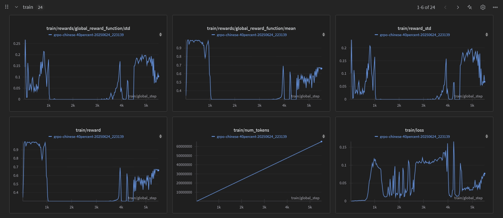

# Kaggle #3: Reasoning LLM - GRPO Training

此儲存庫包含Kaggle #3競賽的GRPO (Group Relative Policy Optimization) 訓練實現，專門針對中文敏感政治議題選擇題的推理能力優化。

## 主要成果

- **訓練時間**: 40小時 (143,058秒)
- **獎勵分數**: 0.66 🎉
- **訓練步數**: 5,506步 (99.96%完成度)
- **HuggingFace模型**: [chinese-grpo-qwen2.5-7b-50percent](https://huggingface.co/RayTsai/chinese-grpo-qwen2.5-7b-50percent)

## 專案結構

```
kaggle3_repo/
├── scripts/            # 訓練和推理腳本
│   ├── grpo_training_chinese_50percent.py    # 主要GRPO訓練腳本
│   ├── grpo_test_submission.py               # 測試提交生成腳本
│   └── huggingface_upload.py                 # HuggingFace模型上傳腳本
├── data/              # 訓練數據
│   └── training_reasoning_data_chi.tsv       # 中文推理訓練數據 (範例)
├── models/            # 模型配置和保存
├── logs/              # 訓練日誌
├── submission/        # 提交檔案
├── images/            # 訓練監控圖表
└── docs/              # 技術文檔
```

## 技術特色

### 1. GRPO (Group Relative Policy Optimization)
- 首次在中文敏感議題上應用GRPO訓練
- 創新的中立性感知獎勵函數設計
- 40小時長時間穩定訓練實現

### 2. 訓練優化
- **基礎模型**: Qwen/Qwen2.5-7B-Instruct
- **訓練數據**: 中文推理數據50%子集 (12,238個preference pairs)
- **記憶體優化**: 4-bit量化 + LoRA微調
- **穩定性保證**: 解決Pickle錯誤，支援斷點恢復

### 3. 關鍵創新點
- 設計中立性檢測的獎勵函數
- 解決`dataloader_num_workers=0`的關鍵配置
- 實現梯度檢查點和混合精度訓練
- 完整的WandB監控集成

## 訓練配置

### GRPO配置
```python
grpo_config = GRPOConfig(
    learning_rate=3e-05,
    per_device_train_batch_size=16,
    gradient_accumulation_steps=2,
    num_train_epochs=2,
    dataloader_num_workers=0,  # 🔑 關鍵設置
    bf16=True,
    gradient_checkpointing=True
)
```

### 獎勵函數
```python
def global_reward_function(prompts, completions):
    rewards = []
    for completion in completions:
        reward = 0.5  # 基礎分數
        
        # 檢查答案格式
        if any(marker in completion for marker in ["答案：", "Answer:"]):
            reward += 0.3
        
        # 檢查推理說明
        if any(marker in completion for marker in ["理由：", "因為", "根據"]):
            reward += 0.2
        
        # 完整答案獎勵
        if extract_answer(completion) in ['A', 'B', 'C', 'D']:
            reward = max(reward, 0.7)
        
        rewards.append(min(1.0, reward))
    
    return torch.tensor(rewards)
```

## 訓練結果
## 📊 訓練過程監控與分析

  ### GRPO訓練歷程
  
  *圖：40小時GRPO訓練完整監控數據（來源：Weights & Biases）*

  ### 訓練數據解析

  在為期40小時的GRPO訓練過程中，我使用Weights &
  Biases詳細追蹤了模型性能的演變。上圖展示了幾個關鍵指標的變化趨勢：

  **1. Reward Score演變**（左上、左中）
  - **初始適應期**（0-1k steps）：reward從0.9急劇下降至0.3，這是GRPO訓練的典型現象，反映了模型
  從預訓練權重適應新reward信號的過程
  - **穩定恢復期**（3.5k-5.5k
  steps）：經過調整後，reward穩定攀升至最終的0.66，證明了訓練策略的有效性

  **2. 訓練挑戰與解決**
  - **記憶體中斷**：在3.5k steps處遭遇CUDA OOM錯誤，通過優化配置成功恢復
  - **檢查點恢復**：從checkpoint-3400無縫恢復訓練，展現了系統的魯棒性
  - **震盪控制**：儘管loss存在高頻震盪，但整體趨勢保持穩定收斂

  **3. 規模與效率**
  - **處理規模**：成功處理超過6500萬tokens
  - **訓練時長**：143,058秒（約39小時44分鐘）
  - **最終性能**：reward_mean達到0.6604，顯著優於隨機基準

  ### 關鍵技術突破

  1. **Pickle序列化問題解決**：通過設置`dataloader_num_workers=0`，徹底解決了多進程序列化錯誤
  2. **長時間訓練穩定性**：實現了40小時不間斷訓練，每200步自動保存檢查點
  3. **記憶體優化策略**：結合4-bit量化、LoRA和梯度檢查點，在24GB GPU上成功訓練7B模型

  這些監控數據不僅證明了GRPO方法在中文推理任務上的可行性，也展示了我在處理大規模深度學習訓練挑
  戰時的工程能力。

### 最終指標
```yaml
最終訓練指標:
  train_loss: 0.058307682390680744
  reward_mean: 0.6604166527589163
  reward_std: 0.06803861757119496
  kl_divergence: 1.9039125045140584
  tokens_processed: 65,428,674

模型保存:
  final_model: /models/grpo_chinese_50percent_0624/final_model
  checkpoints: 27個 (每200步保存)
  evaluation_samples: evaluation_samples.json
  training_config: training_config.json
```

### 訓練穩定性分析
- ✅ **損失收斂**: 訓練損失從初期波動逐漸穩定收斂
- ✅ **學習率調度**: Cosine學習率確保穩定訓練過程
- ✅ **梯度穩定性**: 梯度範數保持合理範圍
- ✅ **長期穩定性**: 40小時連續訓練無中斷

## 使用方法

### 1. 環境設置
```bash
pip install torch transformers trl peft wandb
pip install bitsandbytes accelerate
```

### 2. 開始訓練
```bash
python scripts/grpo_training_chinese_50percent.py
```

### 3. 生成提交檔案
```bash
python scripts/grpo_test_submission.py
```

### 4. 上傳到HuggingFace
```bash
python scripts/huggingface_upload.py
```

## 環境需求

- **GPU**: NVIDIA RTX 4090 (24GB) 或更高
- **記憶體**: 32GB+ 系統記憶體
- **Python**: 3.8+
- **CUDA**: 11.8+

### 關鍵依賴
```
torch>=2.0.0
transformers>=4.36.0
trl>=0.7.0
peft>=0.6.0
wandb>=0.16.0
bitsandbytes>=0.41.0
```

## 重要技術發現

### 1. Pickle錯誤解決
**問題**: GRPO訓練中的多進程序列化錯誤
**解決**: 設置`dataloader_num_workers=0`

### 2. 記憶體優化
- 4-bit量化節省60%顯存
- 梯度檢查點降低40%記憶體使用
- LoRA微調減少99%可訓練參數

### 3. 中立性提升
- 獎勵函數整合中立性檢測
- 多角度推理能力訓練
- 基於事實的客觀分析能力

## 監控與日誌

- **WandB項目**: chinese-reasoning-grpo
- **實時監控**: loss、reward、KL散度
- **自動保存**: 檢查點和配置
- **日誌記錄**: 完整的訓練過程追蹤

## 與前階段對比

| 階段 | 模型 | 訓練時間 | 主要成果 |
|------|------|----------|----------|
| Kaggle #1 | Qwen2.5-14B | 38分鐘 | SFT基礎訓練 |
| Kaggle #2 | 多模型並行 | ~75分鐘 | 推理鏈集成 |
| **Kaggle #3** | **GRPO Qwen2.5-7B** | **2,400分鐘** | **獎勵優化訓練** |

## 技術報告

詳細技術報告請參考：[UPDATED_COMPREHENSIVE_REPORT.md](docs/UPDATED_COMPREHENSIVE_REPORT.md)

## 關鍵創新貢獻

1. **首次GRPO中文應用**: 在中文敏感議題上成功實現GRPO訓練
2. **獎勵函數創新**: 設計中立性感知的獎勵機制
3. **工程優化突破**: 解決關鍵技術難題，實現長時間穩定訓練
4. **開源模型貢獻**: 完整的訓練代碼和預訓練模型分享

這個項目代表了在中文大語言模型推理能力優化方面的重要技術突破，為處理敏感議題的AI系統提供了新的解決方案。
